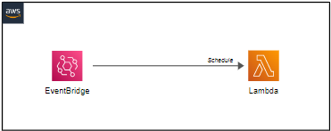
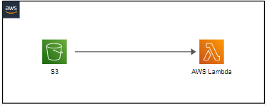
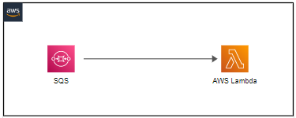

**Bem-vindo à TerraFlow Soluções!**

## Sobre Nós
Na TerraFlow, somos especializados em fornecer soluções avançadas de Infraestrutura como Código (IaC) usando o Terraform para criar e gerenciar recursos na AWS. Nossa equipe é especializada em projetar e desenvolver diversos padrões sem servidor e com servidor para atender às necessidades específicas de negócios. Com ampla experiência em tecnologias nativas da nuvem, garantimos integração e automação perfeitas para sua infraestrutura em nuvem.

## Serviços
Nossa expertise abrange uma ampla gama de serviços projetados para potencializar o seu negócio com soluções escaláveis, eficientes e econômicas.

### Padrões Sem Servidor

#### API HTTP com Amazon API Gateway e AWS Lambda para RDS Proxy
Crie um endpoint de API HTTP que invoca uma função AWS Lambda para o RDS Proxy, garantindo acesso seguro e confiável ao banco de dados.

#### API HTTP com Amazon API Gateway e AWS Lambda
Crie uma API HTTP com Amazon API Gateway e uma função AWS Lambda para disponibilizar serviços para seus clientes.

#### API Gateway para Lambda para DynamoDB
Realize uma solicitação ao API Gateway que salva os dados no DynamoDB.

#### Regra Agendada do EventBridge para Lambda
Crie uma regra agendada no EventBridge para invocar uma função Lambda.

#### S3 para Lambda para SES
Crie uma função Lambda que envie e-mails via SES para eventos do S3.

#### AWS S3 Trigger para AWS Lambda para AWS Glue
Esse padrão cria um gatilho de balde S3 que aciona uma função Lambda sempre que um arquivo chega. A função Lambda é usada para acionar um fluxo de trabalho do Glue com parâmetros de entrada, como chave de arquivo e nomes de balde. Todos os elementos abordados neste padrão são construídos usando o Terraform.

#### Invocar a função Lambda entre contas diretamente por meio do Step Functions
Crie um fluxo de trabalho do Step Functions que invoque a função Lambda entre contas.

#### SQS para Lambda
Crie uma função Lambda que se inscreve em uma fila SQS.

### Padrões com Servidor

#### Amazon API Gateway (HTTP) para AWS Lambda
Este padrão cria um Amazon API Gateway (HTTP) e uma função AWS Lambda.

#### Transmissões do Amazon DynamoDB para AWS Lambda
Este padrão cria uma tabela Amazon DynamoDB com streaming habilitado, uma função AWS Lambda e configuração de fonte de eventos do DynamoDB para a função Lambda.

#### Regra Agendada do EventBridge para Lambda
Crie uma regra agendada no EventBridge para invocar uma função Lambda.

#### Função Lambda e Camadas Lambda
Crie uma Função Lambda que tenha uma Camada Lambda adicionada a ela.

#### Notificações de bucket do Amazon S3 para AWS Lambda
Este padrão cria um bucket do Amazon S3, uma função AWS Lambda e configura notificações de eventos do bucket do S3 para acionar a função Lambda.

#### Amazon S3 com S3 Object Lambda (retorna miniaturas de imagens do S3)
Este padrão cria um bucket S3, um S3 Access Point, um S3 Object Lambda Access Point e uma função AWS Lambda.

#### Fila Amazon SQS para AWS Lambda
Este padrão cria uma fila do Amazon SQS, uma função AWS Lambda e configura um fornecimento de eventos da fila para a função Lambda.

Se você estiver interessado em soluções personalizadas para o seu negócio, não hesite em entrar em contato conosco! Nossa equipe de especialistas está pronta para ajudar a impulsionar o seu sucesso com a nuvem AWS e o poder do Terraform.
